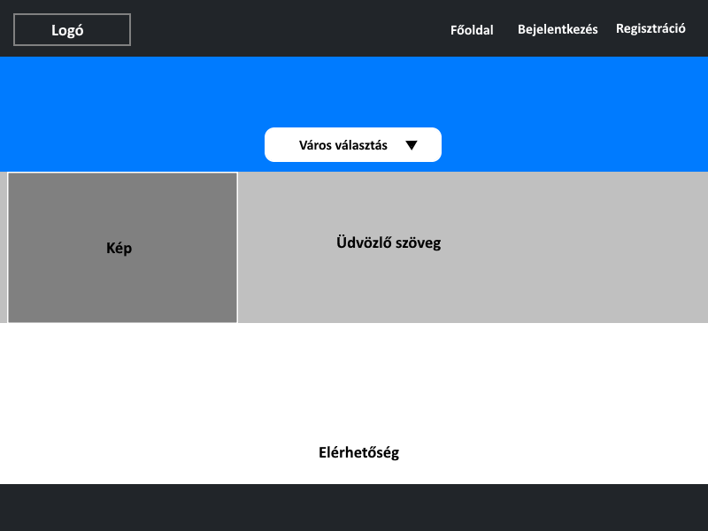
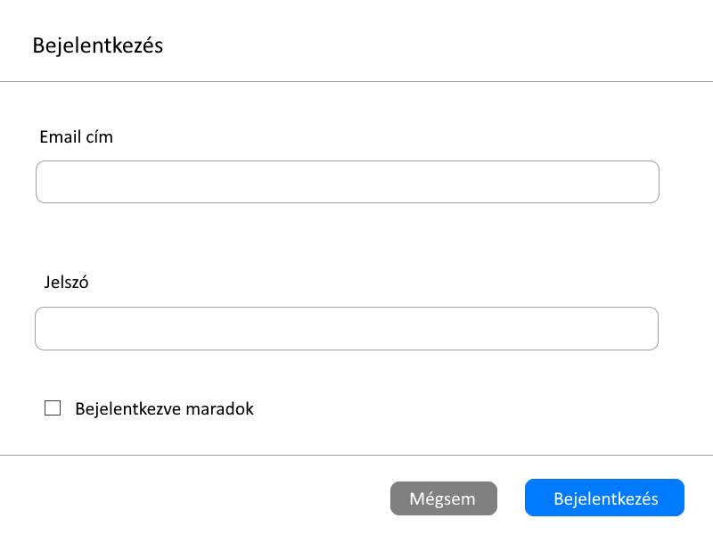
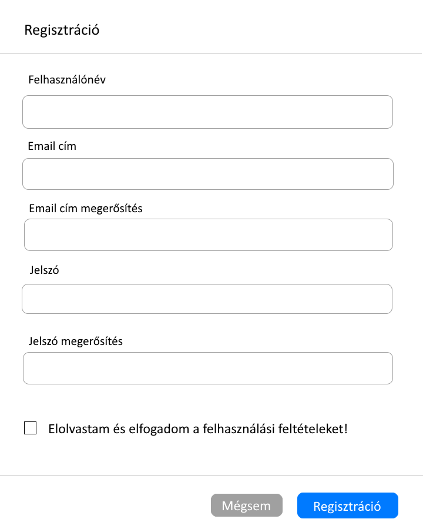
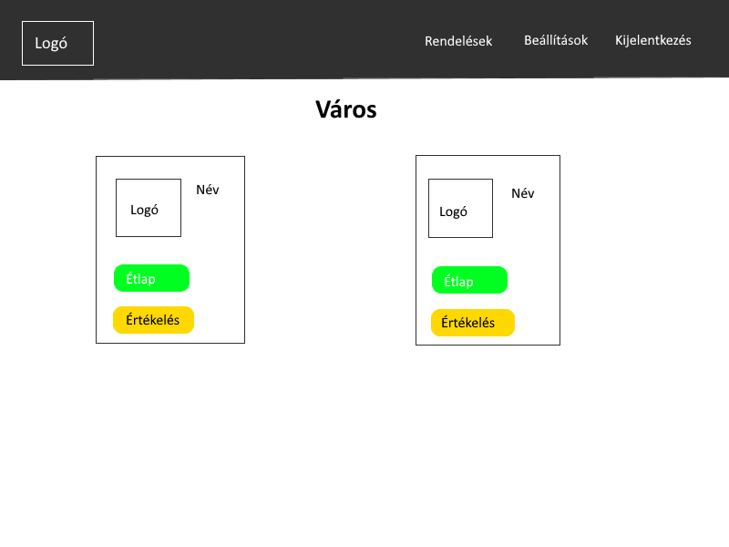
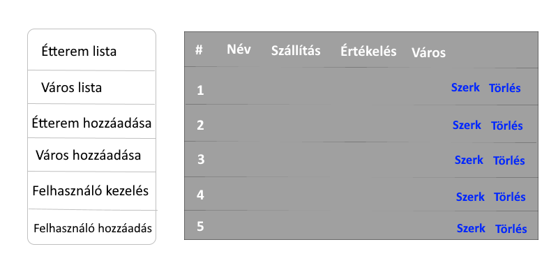

## 1. Áttekintés

A rendszer egy étterem számára elkészítendő weboldal. Az étterem tulajdonos szeretne egy online felületet ahol ételeket tudnának a felhasználók házhoz rendelni vagy előrendelni amit majd az étteremben vennének át. A weboldalnak rendelkeznie kell egy felhasználó felülettel ahol betudnak jelentkezni vagy regisztrálni tudnak a vásárlók, hogy rendelni tudjanak ételeket. Ha nincs fiókja egy látogatónak a weboldalon akkor nem tud rendelni ételeket, viszont látni tudja az étlapot. Készíteni kell egy külön felület az étlapnak, ahol a felhasználók megtekinthetik, hogy mit tudnak rendelni a weboldalról. Fontos, hogy nem csak egy üzletre kell felkészíteni a rendszert, hanem több esetőségre is. A felhasználók rendeléskor ki kell tudják választani, hogy melyik étteremből szeretnének rendelni és csak azután, hogy mit. Rendeléskor minden fontos adatot át kell adjon a felhasználó, hogy a házhozszállítás megfelelően végbemenjen. Ezen adatokat, az éttermeket, a városokat valamint az ételeket adatbázisban kell eltároljuk. Természetesen ha a vásárló szeretné átvenni személyesen akkor ezekre az adatokra nincs szükség. Az étlapnak bővíthetőnek kell lennie. Azaz új étel esetén lehetővé kell tenni a már meglévő étlaphoz való hozzáfűzést. A rendeléseket, valamint az ételeket értékelhetővé kell tenni a felhasználók számára. Ebből láthatóvá válik a felhasználók elégedettsége. A felhasználóknak lehetőségük lesz a már leadott rendeléseiket nyomonkövetni, megtekinthetik rendelésük állapotát. A rendszer karbantartása érdekében, kell egy olyan felhasználó aki az egyes hibákat kezelni tudja, vagy a felhasználók profiljait szerkeszteni tudja. Ezt egy adminisztártori jogkörrel ellátot felhasználó fogja ellátni. Ő tudja módosítani az adatbázist, ezzel szerkeszteni tudja a városokat, az éttermeket valmint a menüket.

## 2. Jelenlegi helyzet

Minden étterem számára több bevételt, több rendelést valamint a vásárlók számára pedig kényelmet jelent az, hogyha online tudnak ételt rendelni. A jelenlegi helyzetre való tekintettel az éttermek számára a megélhetést jelenti a házhoz szállítás, hiszen nem tarthatnak nyitva az éttermek. Az emberek számára pedig ez az egyetlen módja hogy éttermi menüről étkezzenek. Leszámítva ezeket a szempontokat, sok kényelmet jelent az a hétköznapi embereknek, ha otthonról tudnak rendelni. Nem kell kimozdulniuk és kényelmesen elfogyaszthatják az ételt otthon. Sok esetben már előre is kilehet fizetni az ételt így szinte a futárral egy pillantra találkozik a rendelő vagy akár nem is történik kontakt hiszen az ajtóban lehelyezik a csomagot és csengővel jelzik az érkeztét. Ezért is hasznos, szinte már kötelező létrehozni egy olyan rendszert az éttermek számára, ahol az emberek otthonról tudnak ételt rendelni, az étterem pedig biztosítja annak házhoz szállítását. Az éttermek számára szélesebb vendég kört jelent hiszen így több embert el lehet érni. Figyelembe véve, hogy az emberek rengeteg használják mobiljukat, akár úton hazafelé is megrendelhetik ebédjüket, vacsorájukat és mire hazaérnek meg is érkezik az étel. Ezen tényezők mind növelik az étterem forgalmát, valamint elősegítik a vásárlók kényelmét, így mindkét félnek egyaránt profitáló ez a megoldás. Természetesen költésgei lehetnek a házhoz szállításnak és a csomagolásnak de ez elenyésző. Természetesen egyre több étterem készíttet magának egy weboldalt ezért is tanácsos minden étterem számára, egy ilyen weboldal elkészítése, hogy a konkurenciában képes legyen a versenyt tartani. Természetesen a weboldal elkészítésvel kapcsolatban is nagyobb az elvárás a megrendelőtől, hiszen sok ehhez hasonló rendszer létezik az interneten. A rendszernek stabilnak kell lennie, kifejezetten ha az étterem non-stop működik. Ilyen esetben a karbantartás, a hiba elhárításnak azonnalinak kell lennie, hogy a rendelesék zavartalanul történjenek.

## 3. Követelménylista 

1. Bejelentkezési felület
* A felhasználók ezen a felületen jelentkeznek be a weboldalra a bővebb elérés érdekében
* Bejelentkezés után elérhetővé válnak a weboldal funkciói
2. Regisztrációs felület
* A felhasználók itt tudnak beregisztrálni a weboldalra
* Regisztráció nélkül nem elérhetőek a weboldal funkciói
3. Profil menüpont
* A felhasználók itt látják a saját adataikat, esetleg itt módosíthatják a jelszavukat is
* Itt módosíthatják a rendelési címüket is
4. Éttermek menüpont
* Itt választhatja ki a várost, hogy melyik városi étteremből szeretne rendelni
* Itt éri el az éttermek listáját
* Itt fér a felhasználó hozzá az éttermek étlapjaihoz
* Itt tudja leadni a felhasználó a rendeléseit
5. Rendelések menüpont
* A felhasználó itt fér a hozzá a már leadott rendeléseihez
* Itt látja a felhasználó az aktuális rendelésének az állapotát
6. Jogosultságok
* Admin: teljes hozzáférése van a weboldalhoz, módsíthatja az éttermeket, az étlapokat, a felhasználókat, kezelheti az adatbázist
* Felhasználó: regisztráció után kapjuk meg a jogkört, így már adhat le rendeléseket a vásárló, megtekintheti rendelésének állapotát
* Látogató: nem regisztrált felhasználó aki csak megtekintheti az étlapot, de nem rendelhet

## 4. Jelenlegi üzleti folyamatok modellje

A mai világban az éttermek nagyrésze megtalálható és elérhető online, és telefonon is. A webes rendelés sokkal megkönnyítheti az éttermek dolgát mivel a rendelések felvételéhez nem kell munkaerőt csoportosítani. A tervezett weboldalunk ezeket az éttermeket egyesíti egy oldalon, és listázza ki azok étlapját. Ezek az online éttermek még nagyon kezdetleges formátumban találhatók meg, épp ezért készítjük el az adott weboldalt, mert van rá igény.

## 5. Igényelt üzleti folyamatok modellje

    5.1 Bejelentkezés
        5.1.1 Beállítások
    5.2.1 Város kiválasztása
        5.2.1.1 Étterem kiválasztása
            5.2.1.1.1 Étlap megtekintése
            Ha be van jelentkezve a felhasználó:
                5.2.1.1.1 Rendelés
    5.4 Admin panel
        5.4.1 Étterem hozzáadása
        5.4.2 Város hozzáadása
        5.4.3 Menük hozzáadása
        5.4.4 Felhasználók kezelése
    5.5 Regisztráció

## 6. Használati esetek

Adminisztrátor: Az admin felel a rendszer problémamentes működéséért, ezért az egész szerverhez van hozzáférése. Emellett hozzá kell tudnia férni a felhasználók listájához, tudnia kell kezelni az éttermeket, hozzáadni, eltávolítani őket. Tud üzenetet fogadni az éttermektől és válaszolni is nekik. Kedvezményeket tud hozzáadni az éttermekhez. Listázni tud minden tevékenységet.
Felhasználó: Bejelentkezés nélkül: Megnézheti az éttermeket, értékeléseket. Nem tud rendelni.
Bejelentkezés után: Megtekintheti az étlapokat, tudja szűrni/rendezni az étlapot, ételeket pakolhat a kosarába, igény szerint választhat plusz feltétet. Megtekintheti az előző rendeléseit, felveheti a kapcsolatot az étteremmel, értékelni tudja az adott éttermet, kedvezményt tud aktiválni. Módosíthatja a felhasználói adatait.
Étterem: Látja a rendeléseket, el tudja fogadni, illetve utasítani őket, meg tudja nézni a rendelés adatait. Ki tud tiltani felhasználókat az étteremből, segítséget kérhet az adminisztrátortól, nyomtathat számlát, minden adattal, valamint kedvezményt tud hozzáadni az étteremhez. 

## 7. Képernyő tervek

Főoldalterv:

Bejelentkezés terv:

Regisztráció terv:

Étterem kiválasztása adott városban terv:

Admin panel terv:

## 8. Forgatókönyv

Futási időben sok szereplő figyelhető meg. Egy szereplő létrehozza a kvízt, a többi pedig csatlakozhat a kvízhez ez megfelelő kvízazonosító megadása után majd elkezdhetik a kvíz kitöltését. A kvíz résztvevői a teljesítményük alapján pontot kapnak, az idő és a jó válaszok függvényében. A kvíz végén megjelenik a toplista az összes felhasználóval és pontszámával együtt, ahol össze lehet hasonlítani a felhasználók teljesítményét és le is lehet menteni a listát egy táblázat formájában.  
A felhasználók mérföldköveket tudnak elérni a kvízek kitöltésével, melyet a saját profil fölün nyomon tudnak követni. Mindez szemlélteti egyes felhasználók aktivitását és teljesítményét is.

## 9. Fogalomszótár

- **UML** - Unified Modeling Language
- **Releváns** - fontos, lényeges, meghatározó, jelentős
- **Corrective Maintenance:** A felhasználók által felfedezett és "user reportban"
elküldött hibák kijavítása.
- **Adaptive Maintenance:** A program naprakészen tartása és finomhangolása.
- **Perfective Maintenance:** A szoftver hosszútávú használata érdekében végzett
módosítások, új funkciók, a szoftver teljesítményének és működési
megbízhatóságának javítása.
- **Preventive Maintenance:** Olyan problémák elhárítása, amelyek még nem
tűnnek fontosnak, de később komoly problémákat okozhatnak.