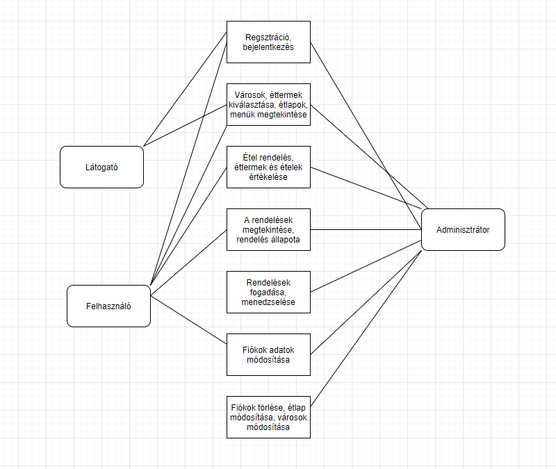

## 1. Rendszer célja

A rendszer célja egy online kvíz weboldal megvalósítása. Egy olyan felület biztosítása ahol az emberek saját maguk hozhatnak létre különböző kvízeket saját kérdésekkel és válaszlehetőségekkel. A weboldal rendelkezni fog pár alapvető kvíz csomaggal. Az egyes kvízek lebonyolítása különféle játékmódokban történik. Egy kérdés megválaszolására véges idő áll rendelkezésre. Az alapján, hogy milyen gyorsan találja el a kérdést a felhasználó pontokat fog elérni. Minél gyorsabban annál több pontot fog kapni jutalmul. A pontrendszert különféle jutalmak feloldásához használjuk valamint mérföldkövek feloldásához. A weboldal elérése reigsztráció után fog megvalósulni. Két jogkört alkalmazunk. Az egyik a felhasználó aki létrehozhat kvízeket és módosíthatja azokat, de csak is a sajátjait. Indíthat játékokat valamint csatlakozhat is azokhoz. Az adminisztrátor felelős a weboldal karbantartásáért. Neki kell jeleznünk ha valami nincs rendben a weboldallal. Ő korlátlanul szerkesztheti bárki kvízeit valamint törölhet is. Fontos hogy ne csak számítógépen tudjuk csatlakozni egyes versenyekhez, hanem mobilon vagy akár tableten is. Fontos, hogy könnyen kezelhető mindenki számára elérhető rendszert hozzunk létre.

## 2. Projektterv

1. Projektszerepkörök:
  * Termék tulajdonos: Devtrio (teljes csapat)
2. Projektmunkások és felelősségek:
  * Backend munkálatok: Csapat tagjai
  * Frontend munkálatok: Csapat tagjai Feladatuk: adatbázis létrehozása az adatok tárolásához, megfelelő funkciók elkészítése az oldal megfelelő működésének érdekében, felhasználói   felület kialakítása.
3. Ütemterv:
  1. Követelmény specifikáció
  2. Funkcionális specifikáció
  3. Rendszerterv
  4. Adatbázis kialakítása
  5. Backend funkciók elkészítése
  6. Frontend design megtervezése
  7. Felhasználói felület kialakítása

## 3. Üzleti folyamatok modellje



## 4. Követelmények

**Funkcionális követelmények**
  - **Felhasználók adatainak tárolása**
  - **Felhasználók tudják változtatni adataikat**
  - **Városok tárolása**
  - **Éttermek tárolása**
  - **Reszponzív webes alapú megjelenítés**
  - **Adminisztrátor tudja szerkeszteni a éttermek adatlapjait és a hozzá tartozó étlapokat**
  - **A felhasználók képesek rendelést leadni az adott étteremnek**

  **Nem funkcionális követelmények**
  - **A felhasználók nem férnek hozzá egymás adataihoz**

  **Törvényi előírások, szabványok:**
  - **GDPR-nek való megfelelés**

## 5. Funkcionális terv

  **Rendszerszereplők:**
  - **Adminisztrátor**
  - **Felhasználó**
  - **Vendég**

  **Rendszerhasználati esetek és lefutásaik:**
  - **Adminisztrátor**
    - **Képes felhasználókat törölni**
    - **Tudja módosítani a felhasználók jelszavát és adatait is**
    - **Látja az összes regisztrált felhasználót**
    - **Módosítani tudja a városokat, éttermeket és az étlapokat**
    - **Teljes hozzáférése van a rendszerhez**
  - **Felhasználó**
    - **Megtekintheti az éttermeket, és lekérheti a hozzátartozó étlapokat**
    - **Módosíthatja a saját adatait**
    - **Módosíthatja jelszavát**
    - **Adhat le rendelést az adott étteremhez**
  - **Vendég**
    - **Láthatja az éttermeket, és azok étlapjait**
    - **Képes regisztrálni és bejelentkezni**
    - **Nem tud rendelést leadni**

  - **Menü-hierarchiák:**
    - **Bejelentkezés**
    - **Regisztráció**
    - **Főoldal**

    - **Bejelentkezés után:**
      - **Felhasználók listája:** kizárólag admin joggal rendelkező felhasználóknak
      - **Éttermek listája:** kizárólag admin joggal rendelkező felhasználóknak
      - **Étlap módosítás/hozzáadása:** kizárólag admin joggal rendelkező felhasználóknak

      - **Éttermek**
      - **Városok**
      - **Kijelentkezés**

## 6. Fizikai környezet
  - **Az alkalmazás csak web platformra készül.**
  - **Nincsenek megvásárolt komponensek.**
  - **Fejlesztői eszközök:**
    - **Visual Studio Code**
    - **Notepad++**
    - **Sublime text 3**
    - **MySQL Workbench**
    - **HediSQL** 

## 7. Architekturális terv

A rendszerhez szükség van egy adatbázis szerverre, ebben az esetben MySql-t használunk, ebbe visszük fel a felhasználók, városok, éttermek és rendelések listáját. A backend php alapú. A bootstrap, a CSS keretrendszer felel a reszponzív webdesign-ért.

## 8. Adatbázis terv

**Táblák**
- **felhasználók:** Minden felhasználó, aki az oldalon regisztrált
  - **id:** Azonosító szám, mindenképp felvesz egy egész típusú értéket, amit a rendszer automatikusan generál és egyesével növekszik, nem lehet két azonos szám
  - **felhasználónév:** A felhasználók bejelentkezési/felhasználói neve, nem lehet üres
  - **jelszó:** Nem lehet üres a mező
  - **email:** Egyedi, tehát nem lehet két felhasználónak ugyanazon email címe és egyben nem lehet üres mező
  - **jog:** Egész érték, nem lehet üres mező
- **Kérdés:**
  - **kérdésid:** Minden kérdés egyedi azanosítóval bír, automatikusan növekszik és nem lehet üres mező
  - **Kérdés:** A kvízben szereplő kérdés szövege
  - **helyesVálaszid:** Az kérdéshez tartózó helyes válasz
- **Válasz:**
  - **válaszid:** Az adott válasz egyedi azonosítója, nem lehet üres és automatikusan növekszik
  - **válasz:** A válasz szövege
  - **kérdésid:** A kérdéshez tartozó válasz (ez nem feltétlenül a helyes válasz!)

**DSL**
```
DROP TABLE IF EXISTS Felhasználók;

DROP TABLE IF EXISTS Kérdés;

DROP TABLE IF EXISTS Válasz;

CREATE TABLE Felhasználók (
	id integer PRIMARY KEY AUTOINCREMENT,
	felhasználónév text,
	jelszó text,
	email text,
	jog integer
);

CREATE TABLE Kérdés (
	kérdésid integer PRIMARY KEY AUTOINCREMENT,
	kérdés text,
	helyesVálaszid integer
);

CREATE TABLE Válasz (
	válaszid integer PRIMARY KEY AUTOINCREMENT,
	válasz text,
	kérdésid integer
);

```
**UML**
<br>


## 11. Telepítési terv

1. Python telepítése
   * Platformnak megfelő python telepítőcsomag letöltése
   * Telepítés
2. (Opcionális) Apache telepítése
3. Adatbázis telepítése - SQLite (Automatikus)
4. Django kód telepítése <br> ```python -m pip install Django```

## 12. Karbantartási terv

A felhasználók egy report formájában tudják jelenteni a felmerűlő funkcionális hibákat és az adminok tudják javítani. <br>
A javított hibák egy oldalon Changelog vagy hír formában meg fognak jelenni visszajelzésként a felhasználók felé, az új funkciók / frissítésekkel együtt.