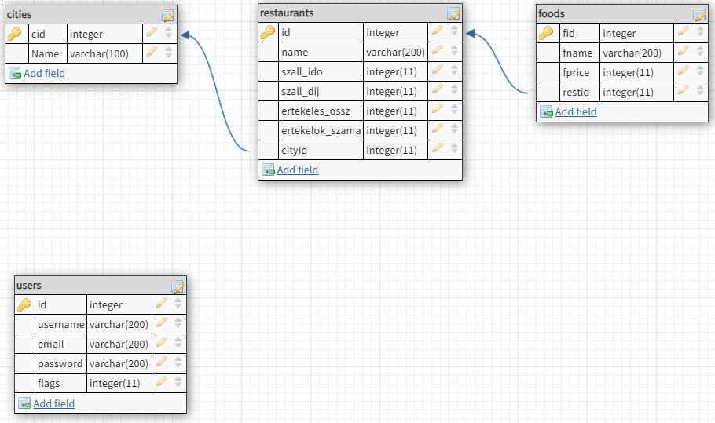

## 1. Rendszer célja

A rendszer célja egy online kvíz weboldal megvalósítása. Egy olyan felület biztosítása ahol az emberek saját maguk hozhatnak létre különböző kvízeket saját kérdésekkel és válaszlehetőségekkel. A weboldal rendelkezni fog pár alapvető kvíz csomaggal. Az egyes kvízek lebonyolítása különféle játékmódokban történik. Egy kérdés megválaszolására véges idő áll rendelkezésre. Az alapján, hogy milyen gyorsan találja el a kérdést a felhasználó pontokat fog elérni. Minél gyorsabban annál több pontot fog kapni jutalmul. A pontrendszert különféle jutalmak feloldásához használjuk valamint mérföldkövek feloldásához. A weboldal elérése reigsztráció után fog megvalósulni. Két jogkört alkalmazunk. Az egyik a felhasználó aki létrehozhat kvízeket és módosíthatja azokat, de csak is a sajátjait. Indíthat játékokat valamint csatlakozhat is azokhoz. Az adminisztrátor felelős a weboldal karbantartásáért. Neki kell jeleznünk ha valami nincs rendben a weboldallal. Ő korlátlanul szerkesztheti bárki kvízeit valamint törölhet is. Fontos hogy ne csak számítógépen tudjuk csatlakozni egyes versenyekhez, hanem mobilon vagy akár tableten is. Fontos, hogy könnyen kezelhető mindenki számára elérhető rendszert hozzunk létre.

## 8. Adatbázis terv

**Táblák**
- **felhasználók:** Minden felhasználó, aki az oldalon regisztrált
  - **id:** Azonosító szám, mindenképp felvesz egy egész típusú értéket, amit a rendszer automatikusan generál és egyesével növekszik, nem lehet két azonos szám
  - **felhasználónév:** A felhasználók bejelentkezési/felhasználói neve, nem lehet üres
  - **jelszó:** Nem lehet üres a mező
  - **email:** Egyedi, tehát nem lehet két felhasználónak ugyanazon email címe és egyben nem lehet üres mező
  - **jog:** Egész érték, nem lehet üres mező
- **Kérdés:**
  - **kérdésid:** Minden kérdés egyedi azanosítóval bír, automatikusan növekszik és nem lehet üres mező
  - **Kérdés:** A kvízben szereplő kérdés szövege
  - **helyesVálaszid:** Az kérdéshez tartózó helyes válasz
- **Válasz:**
  - **válaszid:** Az adott válasz egyedi azonosítója, nem lehet üres és automatikusan növekszik
  - **válasz:** A válasz szövege
  - **kérdésid:** A kérdéshez tartozó válasz (ez nem feltétlenül a helyes válasz!)

**DSL**
```
DROP TABLE IF EXISTS Felhasználók;

DROP TABLE IF EXISTS Kérdés;

DROP TABLE IF EXISTS Válasz;

CREATE TABLE Felhasználók (
	id integer PRIMARY KEY AUTOINCREMENT,
	felhasználónév text,
	jelszó text,
	email text,
	jog integer
);

CREATE TABLE Kérdés (
	kérdésid integer PRIMARY KEY AUTOINCREMENT,
	kérdés text,
	helyesVálaszid integer
);

CREATE TABLE Válasz (
	válaszid integer PRIMARY KEY AUTOINCREMENT,
	válasz text,
	kérdésid integer
);

```
**UML**


## 11. Telepítési terv

1. Python telepítése
   * Platformnak megfelő python telepítőcsomag letöltése
   * Telepítés
2. (Opcionális) Apache telepítése
3. Adatbázis telepítése - SQLite (Automatikus)
4. Django kód telepítése <br> ```python -m pip install Django```

## 12. Karbantartási terv

A felhasználók egy report formájában tudják jelenteni a felmerűlő funkcionális hibákat és az adminok tudják javítani. <br>
A javított hibák egy oldalon Changelog vagy hír formában meg fognak jelenni visszajelzésként a felhasználók felé, az új funkciók / frissítésekkel együtt.